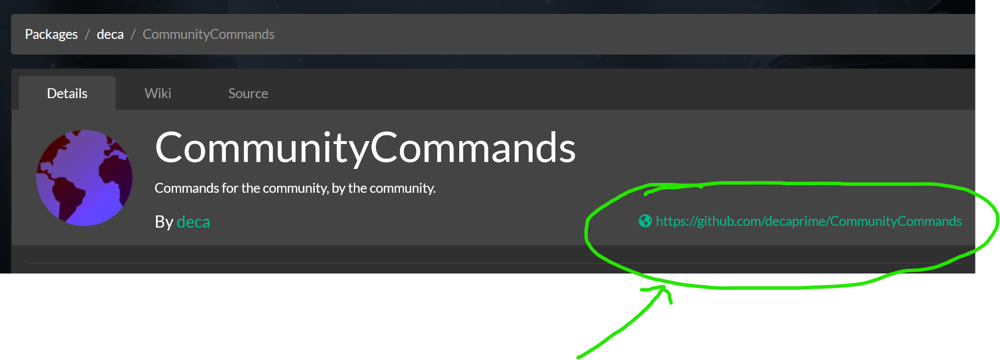

# V Rising Modding
This repo will contain notes about modding V Rising.


## Hosting a dedicated server locally

In steam library, use the filter to show **Tools** in addition to Games.
There is a tool called "V Rising Dedicated Server" - this is what's used to run a proper server.

This video is slightly outdated but its a good starting point.
https://www.youtube.com/watch?v=4qeEyTVV-qU

You will probably want to make yourself an admin. Find the adminlist and put your steam id in there.
At the time of writing, I found the adminlist in the server folder at `.\save-data\Settings\adminlist.txt`


## BepInEx

Bepis Injector Extensible (BepInEx) is the magic that makes it all possible.

"BepInEx is a plugin / modding framework for Unity Mono, IL2CPP and .NET framework games (XNA, FNA, MonoGame, etc.)"

There's a preconfigured pack for V Rising: https://v-rising.thunderstore.io/package/BepInEx/BepInExPack_V_Rising/

Follow the installation instructions at the link.

After installation, you will need to run the game once and bepinex will generate a bunch of stuff.

## General mod installation

Installing a mod is as simple as copying a DLL file into the `./BepInEx/Plugins/` directory of your server.


## Bloodpebble

Bloodpebble provides hot-reloading capabilities for your mods so you don't have to restart the server every time you want to test a change.


https://thunderstore.io/c/v-rising/p/cheesasaurus/Bloodpebble/

Follow the installation instructions at the link.

To hot reload mods you will put them in `./BepInEx/BloodpebblePlugins/` instead of the usual Plugins folder.\
Reloading is automatically triggered by file changes.


## VCF
Vampire Command Framework (VCF) is a framework for creating chat commands.

What's a chat command? Its like a console command, except using the in-game chat instead of a console.
If you've played on a duel server and given yourself a blood potion by typing `.bp` - that is a chat command.

https://v-rising.thunderstore.io/package/deca/VampireCommandFramework/

Follow the installation instructions at the link.


## .NET SDK

You will need .NET SDK version 6.0 to create your own mods.

https://dotnet.microsoft.com/en-us/download/dotnet/6.0

At the time of writing, version 8 was recently released. Do not use that. V Rising uses version 6. Its ok if you have something newer already - you will be able to specify the TargetFramework for your project. But you still need to install SDK version 6.


## Creating your own mod

There's a nice project template for V Rising Mods.
https://github.com/decaprime/VRising.ModTemplate

The README explains how to install and use the project template. Note that you have to be in in the `templates` dir to do the installation step.

Example usage: `dotnet new vrisingmod -n MyMod --description "My Mod" --use-vcf --use-bloodstone`

The template creates something similar to what you would get from following the [bepinex tutorial](https://docs.bepinex.dev/articles/dev_guide/plugin_tutorial/2_plugin_start.html), with some additional stuff:
- Bloodstone and VCF already set up
- nuget.config
- an example VCF command (commented out) in Plugin.cs

If you can't build your project due to unresolved package references, you may need to tweak nuget.config (I had to). Most of the dependencies are available on [nuget.org](https://www.nuget.org/packages), so add it as a source.

e.g.
```
<configuration>
  <packageSources>
    <add key="BepInEx" value="https://nuget.bepinex.dev/v3/index.json" />
    <add key="Samboy Feed" value="https://nuget.samboy.dev/v3/index.json" />

    <add key="nuget.org" value="https://api.nuget.org/v3/index.json" protocolVersion="3" />

  </packageSources>
</configuration>
```

## Development Workflow

This is how I do it:
1) Start the V Rising server.
2) Start the V Rising client and connect to the server.
3) Iterate on the project.

Project iteration looks like this:
1) Make some code changes in my project.
2) Build the project with `dotnet build`
   - if you need dlls for dependencies, you can use `dotnet publish` instead
4) Copy the DLL to `BepInEx/BloodstonePlugins/`
5) Wait for bloodpebble to automatically reload the mod (only takes a couple seconds)
6) Test changes in game.
7) Repeat

Step 3 can be automated with some changes to the `.csproj` file in your project.

e.g.
```
<PropertyGroup>
  <VRisingServerPath>E:\Games\SteamLibrary\steamapps\common\VRisingDedicatedServer</VRisingServerPath>
</PropertyGroup>

<Target Name="Deploy To Dev" AfterTargets="AfterBuild">
  <Copy SourceFiles="$(OutputPath)\MyMod.dll" DestinationFolder="$(VRisingServerPath)/BepInEx/BloodstonePlugins" />
</Target>
```


## Logging

https://docs.bepinex.dev/articles/dev_guide/plugin_tutorial/3_logging.html

## ProjectM

"ProjectM" was the codename for V Rising. You will be using this namespace a lot.


## ECS

V Rising is built on [Unity DOTS](https://unity.com/dots), which is an Entity Component System (ECS) framework.

If you're going to get anywhere, you need to understand the ECS paradigm.
https://en.wikipedia.org/wiki/Entity_component_system

Pretty much anything you do tends to follow this pattern
1) Get a handle on one or more Entities (sometimes using the [EntityManager](https://docs.unity3d.com/Packages/com.unity.entities@0.0/api/Unity.Entities.EntityManager.html))
2) Load particular Components of those Entities that you need for some operation (usually using the EntityManager)
3) Perform the operation in bulk

A Component is just a bag of data related to an Entity. For example, an entity that can walk around might have an associated WorldPosition component with x, y, z properties.

A System can be thought of as one small Step within the pipeline of a single game tick. Each tick updates *hundreds* of systems.


## Hooks

To run some code in response to something happening (traditionally thought of as "hooking" events), remember the ECS paradigm. The point of ECS is to efficiently perform bulk operations.

For example, let's say we want to respond to an item being thrown on the ground. There is no `ThrowItemOnGround` method to hook.

Instead, we hook the `Update` method of the `DropItemThrowSystem`, which is responsible for processing all items to be thrown on the ground within that tick.

Most systems come with an entity query that can be used to find all the entities which will be processed by the update.
A lot of the time those entities can be thought of as Jobs/Tasks - a specification of something to be done by the system. Which is very similar to an Event, but instead of specifying what already happened, they specify what is going to happen.

[Harmony](https://github.com/BepInEx/HarmonyX/wiki) (included with bepinex) provides us with a Prefix and Postfix hook.

The Postfix hook doesn't really help us here, because after the update is done, the entity query most likely isn't going to tell us what was processed.
We need to use the Prefix hook, before the update happens.

e.g.

```
using HarmonyLib;
using ProjectM;
using Unity.Collections;
using Unity.Entities;

[HarmonyPatch(typeof(DropItemThrowSystem), nameof(DropItemThrowSystem.OnUpdate))]
public static class ItemDroppedThrownHook {

    public static void Prefix(DropItemThrowSystem __instance) {
        var jobs = __instance.__CreateDropItemThrowsJob_entityQuery.ToEntityArray(Allocator.Temp);
        foreach (var entity in jobs) {
            HandleItemWillBeDropped(entity);
        }
    }

    private static void HandleItemWillBeDropped(Entity entity) {
        Plugin.Logger.LogMessage("An item will be dropped via 'throw' job");
    }

}
```

## Use Existing Mods as Example Code

A lot of V Rising mods from [thunderstore](https://v-rising.thunderstore.io/) are open source.

The source tab shows a truncated version of the decompiled DLL. You most likely want the *actual* source, so use the github link.

e.g.


## Decompiling DLLs

dotPeek is a free (and awesome) tool for decompiling DLLs.
https://www.jetbrains.com/decompiler/


## Prefab GUIDs

https://github.com/cheesasaurus/v-rising-prefabs-gloomrot


## Snippets

check component types of an entity
```
var componentTypes = WorldUtility.FindServerWorld().EntityManager.GetComponentTypes(entity);
foreach (var componentType in componentTypes) {
    Plugin.Logger.LogMessage(componentType.ToString());
}
```

get specific component of an entity
```
// this retrieves the Equipment component of a character Entity
var equipment = WorldUtility.FindServerWorld().EntityManager.GetComponentData<Equipment>(characterEntity);
```


